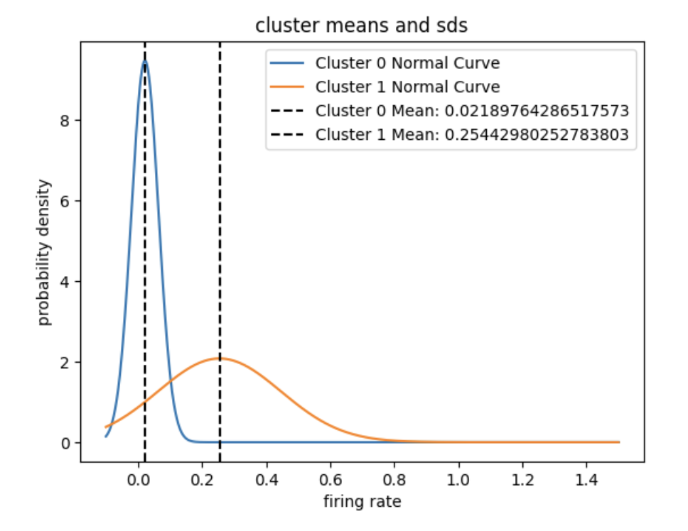
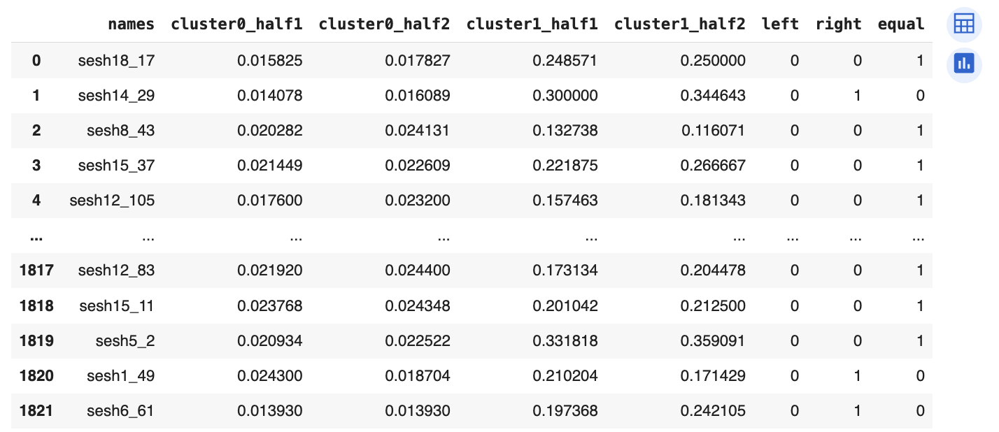
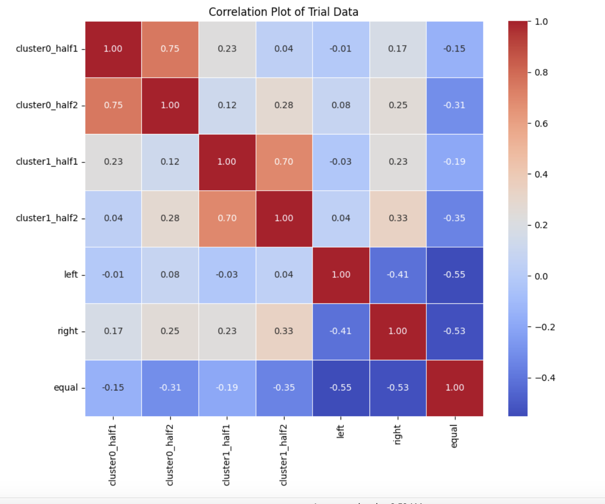
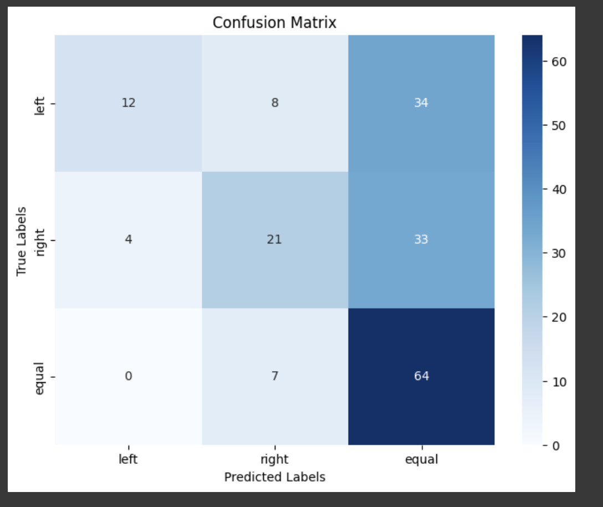

# mice_neuron_data_ml
# Section 2 Exploratory analysis:


## Graphing average neurons across trial conditions:

After organizing the data in custom classes in python, I started my exploratory data analysis by plotting the element wise averages of the neuron matrices for each of the different experimental conditions for each session<sup>1</sup>. I defined the conditions as "left true", "right true", "left false", "right false", and "equal true", where the first part of the name corresponds to whether the left or right constrat was higher, and the second part corresponds to whether the mouse predicted it correctly. There were 5*18 graphs in total to reflect the 5 experimental conditions and the 18 sessions. 


In this graph, I noticed that there were not many visiable differences between the trial conditions for each session. There also appeared to be some noisy neurons that were always active, such as the two bright lines in the graph above. 

<sup><sup>1</sup> _Because individual neurons measured differ between sessions, these comparisons had to be done separately for each session. Conditions were choosen based on which contrast was higher rather than the actual values of each contrast to ensure we had enough data points to preform a robust analysis_</sup>

## pairwise Welch's t-test to determine significant brain areas 

I thought these noisy neurons observed in the previous step may hint at certain brain areas that are always active and are not good predictors of the visual stimuli. Because of this, I decided to do a significance test to decide which brain areas to remove. I started by doing some research about the brain areas in order to get a better idea of what areas were likely to be important in order to ensure my findings in the significance test matched domain intuition. For full descriptions, see my code.


To perform the test, I extracted all the neurons corresponding to each brain area and split them up by their trial condition. Because my project aims to determine what the mice is most likely to be preciving, trials where the mouse anwsered incorrectly could skew my results since isn't clear what the mouse was percieving it as. Thus I only used the conditions 'left true', 'right true' and 'equal true'. To account for differences in when the neurons activate, I decided to store the means of each neuron's data in the first half of the .4 seconds and the mean of each neuron's data for the second half of the .4 seconds in a seperate lists. Once I had lists for all brain areas and trial conditions, I performed pairwise welches t-tests<sup>2</sup> to determine the brain areas who's mean was significantly different across trial conditions at alpha = .01<sup>3</sup>. I then plotted the data and took the union of all the brain areas that were significant at alpha = .01 for at least one comparison:


<small>_in this figure LR represents the comparision between the 'left true' and 'right true' experimental conditions, ER denotes 'equal true' compared to 'right true', etc._</small>


_This graph shows the results of the significance testing for the condition 'right true' versus 'left true' for the latter .2 seconds of the neural recording. The bars represent the brain areas and their t-score associated with how much the means of the activation rate for their associated neurons differ between the two experimental conditions. The read line denotes alpha = .05 and the blue line denotes alpha = .01. I decided to use alpha = .01_

My findings allowed me to rule out 17 brain areas who were not significant differentiating any of the trial conditions. The remaining brain areas were: CP, MOp, SUB, VISl, GPe, LP, LS, CA1, ACB, LSc, AUD, MEA, VISa, VPL, SSs, MG, VISam, DG, MS, LD, ZI, RN, PL, MB, VISpm, VISrl, ACA, TT, CA3, root, VPM, NB, TH, LGd, MOs, POST, VISp, MRN, LSr, ILA, PT, MD, PO, RT, and ORB. Many of these are consistant with my initial research on brain area function and which are likely to be used in learning and visual perception. 

<sup><sup>2</sup> _welches t-tests choosen to reflect the differing sample sizes. Student t-test assumes equal variance, which is not a safe assumption when the sample sizes greatly differ as they did between 'equal' groups and 'right' or 'left' groups. This is because all of the equal groups were marked as true, where as for 'right' and 'left' we only looked at conditions where the mouse anwsered correctly. Welch's test does not assume equal variances_</sup>

<sup><sup>3</sup> _alpha = .01 choosen to limit number of features selected to reduce RAM usage and model run time_</sup>

My original plan was to use these brain areas as the features for which to bridge neurons across sessions, however, I quickly realised that each individual brain area only present in a small subset of the data with little overlap between them; thus this goal proven impractical and I decided to try clustering. 

# Section 3 Data integration

## Clustering 

In order to ensure my clusters were not dominated by the trial situations, I created another custom class with the attribute left_right_equal to represent a 120 (3x40) element list containing the element wise averages across time for all the instances of that neuron in the trial situation 'left true' (first 40 elements), followed by the element wise averages across time for all the instances of that neuron in the trial situation 'right true' (second 40 elements), followed by the element wise averages across time for all the instances of that neuron in the trial situation 'equal true' (first last 40 elements)
Originally I tried to find three clusters, however, one of the clusters was very small, so I limited my analysis to only 2. Although the TSNE visual plot does not show much differentiation between clusters, plotting the cluster means and standard deviations as normal curves shows noticable differences<sup>4</sup>



<sup><sup>4</sup> _Normal curves used since we preformed the clustering on means, and the CLT tells us that for large sample sizes, the expected value of the mean follows an approxiemently normal distribution centered at the E(xbar), which is the cluster mean_</sup>

## Creating Data Frame

Now that I had a way of grouping neurons across sessions, I was able to create a dataframe in pandas.



_cluster0_half1	represents the mean firing rate for the neurons from that trial in cluster 0 for the first half of the .4 second time interval. cluster0_half2, cluster1_half1, and cluster1_half2 have analogous meanings. Rows represent trials. Note: I only included trials where the mouse anwsered correctly due to my goal on trying to understand the relationship between the neurons and what the mouse is percieving. 'Right' will equal 1 when right contrast  > left contrast, 'Left' will equal 1 when left contrast  > right contrast, otherwise, 'Equal' will be 1_ 


Then I plotted the correlation matrix to ensure that my predictors were describing the target values well, and to my dismay I found almost no correlation between my predictors and the column 'left':



I tried to revisit my brain area selection as well as trying without clusters and with different clusters, but no matter how I processed the data, I was never able to improve the correlation between my predictors and 'left'

## Predictive modeling

As stated earlier, my approach for this project is to try to predict what the mouse percieved based on the neuron data, and then compare what they percieved with what the contrast values were in order to predict feedback type. Thus I trained my model on only the trials were the mouse anwsered correctly in order to ensure that the neuron values correspond to the vales we should expect when the mouse is percieving those contrasts. 

I decided to use a feedforward neural net with the following parameters which I found after parameter tuning in order to predict the probabilities of the one-hot-encoded output:

```
model = Sequential([
        Dense(64, activation='relu', input_shape=(X_train.shape[1],)),
        Dense(4096, activation='relu'),
        Dense(256, activation='relu'),
        Dense(256, activation='relu'),
        Dense(256, activation='relu'),
        Dense(3, activation='softmax') # three output neurons to account for the 3 categories we are trying to predict 
    ])
    model.compile(optimizer='adam', loss='categorical_crossentropy', metrics=['accuracy'])
```
However, after running the model, I noticed that it was always predicting 'equal' more than any other class. 



_Regardless of the true trial condition, my model is most likely to predict 'equal'_

I investigated the data and realized this was likely due to the fact that the 'equal' class was greatly over represented in my dataframe. This is because I was only selecting the conditions for hich the mouse anwsered correctly, and based on the experimental design, any anwser for equal was marked as correct. Thus there were more 'equal' values than 'left' or 'right'

```
Number of rows where 'right' equals 1: 518
Number of rows where 'left' equals 1: 547
Number of rows where 'equal' equals 1: 757
```

In order to remedy this, I made the difficult decision to remove some of the 'equal' rows in order to make it even with the other 2 classes. I also scaled the data using min_max scaling with the hopes that may help performance <sup>5</sup> . To deal with the loss of data from removing rows, I used kFolds validation to train my data to ensure that I was still using all the data in my training across all the folds. 

<sup><sup>5</sup> Standardization was done on the whole dataset rather than the training, testing, and validation sets seperately due to the challenges of standardizing seperately for every iteration within the k folds loop</sup> 

Within the folds, I used 5% of the data for validation and 5% for testing. I used the validation data when training in order to implement early stopping to prevent overfitting (model stops early when validation accuracy stops improving alongside training accuracy) and model checkpoints (only updates the weights when the validation accuracy improves)
Note: validation data and test data is seperate. No testing data was seen during training.

At the end of each fold, I evaluated the model on the test data for that fold and printed a confusion matrix like the following example:


The average testing accuracy across the kFolds was 55% (note that they are selecting among 3 possibilities, so random chance would result expected accuracy of 33%, thus the model preforms 22% better than random chance) 
The highest kFold testing accuracy was 60%, or nearly 30% better than random chance. One thing I noticed was that most of the matrices show that the model determines 'equal' with higher accuracy than 'left' or 'right'. I think this corresponds with the higher correlations between the predictors and the 'equal' column than the other y columns as we saw in the correlation matrix


