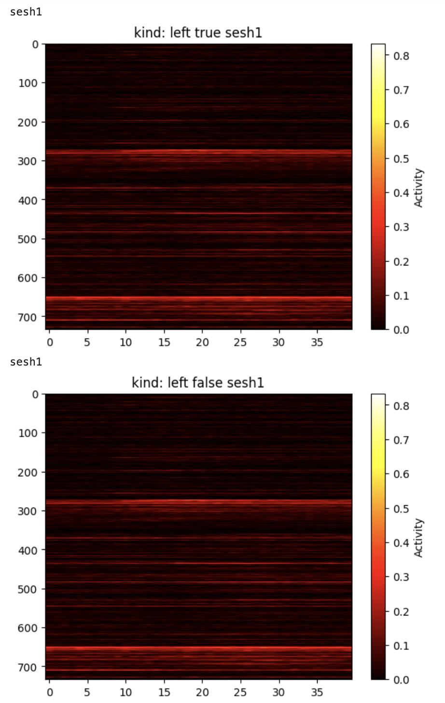
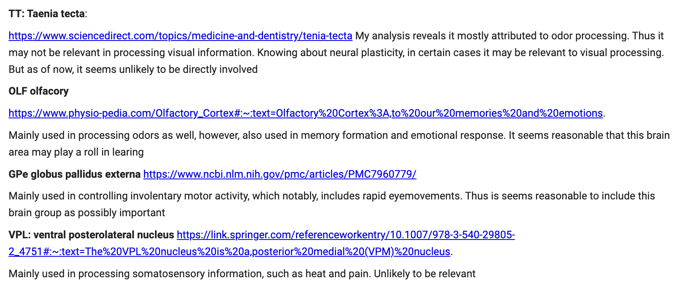

# mice_neuron_data_ml
# Section 2 Exploratory analysis:

Add your tiny text

## Graphing average neurons across trial conditions:

After organizing the data in custom classes in python, I started my exploratory data analysis by plotting the element wise averages of the neuron matrices for each of the different experimental conditions for each session1. I defined the conditions as "left true", "right true", "left false", "right false", and "equal true", where the first part of the name corresponds to whether the left or right constrat was higher, and the second part corresponds to whether the mouse predicted it correctly. There were 5*18 graphs in total to reflect the 5 experimental conditions and the 18 sessions. 

In this graph, I noticed that there were not many visiable differences between the trial conditions for each session. There also appeared to be some noisy neurons that were always active, such as the two bright lines in the graph above. 

1 _Because individual neurons measured differ between sessions, these comparisons had to be done separately for each session_

## pairwise Welch's t-test to determine significant brain areas 

I thought these noisy neurons observed in the previous step may hint at certain brain areas that are always active and are not good predictors of the visual stimuli. Because of this, I decided to do a significance test to decide which brain areas to remove. I started by doing some research about the brain areas in order to get a better idea of what areas were likely to be important in order to ensure my findings in the significance test matched domain intuition. For full descriptions, see my code.

To perform the test, I extracted all the neurons corresponding to each brain area and split them up by their trial condition. Because my project aims to determine what the mice is most likely to be preciving, trials where the mouse anwsered incorrectly could skew my results since isn't clear what the mouse was percieving it as. Thus I only used the conditions 'left true', 'right true' and 'equal true'. To account for differences in when the neurons activate, I decided to store the means of each neuron's data in the first half of the .4 seconds and the mean of each neuron's data for the second half of the .4 seconds in a seperate lists. Once I had lists for all brain areas and trial conditions, I performed pairwise welches t-tests2 to determine the brain areas who's mean was significantly different across trial conditions at alpha = .013. I then plotted the data and took the union of all the brain areas that were significant at alpha = .01 for at least one comparison:

<small>_in this figure LR represents the comparision between the 'left true' and 'right true' experimental conditions, ER denotes 'equal true' compared to 'right true', etc._</small>

<small>_This graph shows the results of the significance testing for the condition 'right true' versus 'left true' for the latter .2 seconds of the neural recording. The graph shows each of the brain areas and their t-score associated with how much the means of the activation rate for their associated neurons differ between the two trial conditions. The read line denotes alpha = .05 and the blue line denotes alpha = .01. I decided to use alpha = .01 to reduce the the number of features being selected since I was ultimately planning to take the union across all 6 pairwise comparisons_</small>

My findings allowed me to rule out 17 brain areas who were not significant differentiating any of the trial conditions. The remaining brain areas were: CP, MOp, SUB, VISl, GPe, LP, LS, CA1, ACB, LSc, AUD, MEA, VISa, VPL, SSs, MG, VISam, DG, MS, LD, ZI, RN, PL, MB, VISpm, VISrl, ACA, TT, CA3, root, VPM, NB, TH, LGd, MOs, POST, VISp, MRN, LSr, ILA, PT, MD, PO, RT, and ORB. Many of these are consistant with my initial research on brain area function and which are likely to be used in learning and visual perception. 

<small>2 _welches t-tests choosen to reflect the differing sample sizes. Student t-test assumes equal variance, which is not a safe assumption when the sample sizes greatly differ. Welch's test does not assume equal variances_</small>

<small>3 _alpha = .01 choosen to limit number of features selected to reduce RAM usage and model run time_</small>

<small>This text will be smaller</small>
This text will be smaller
