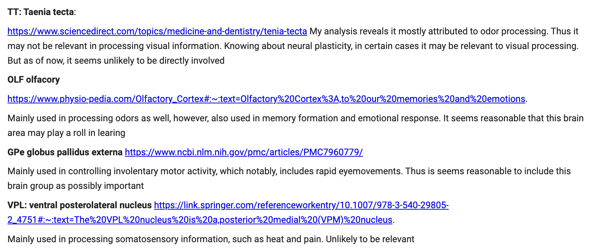
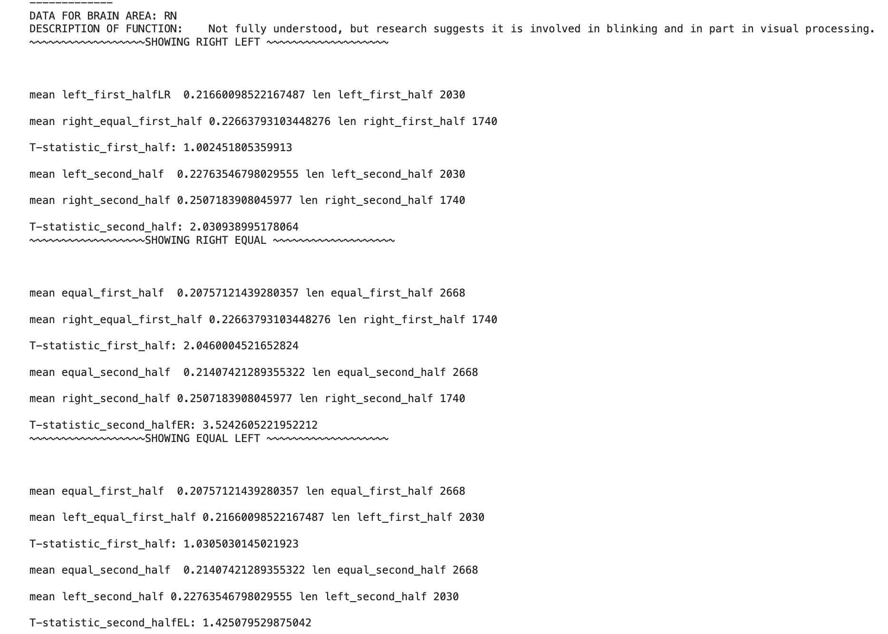
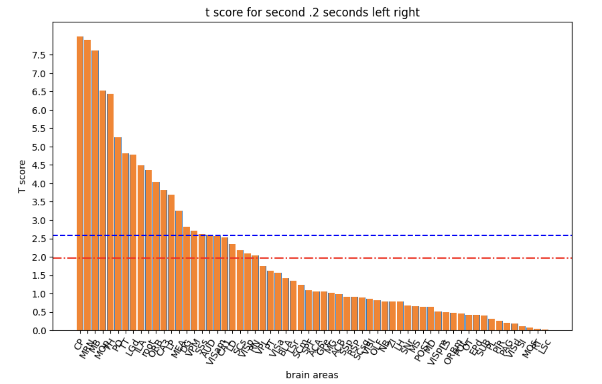
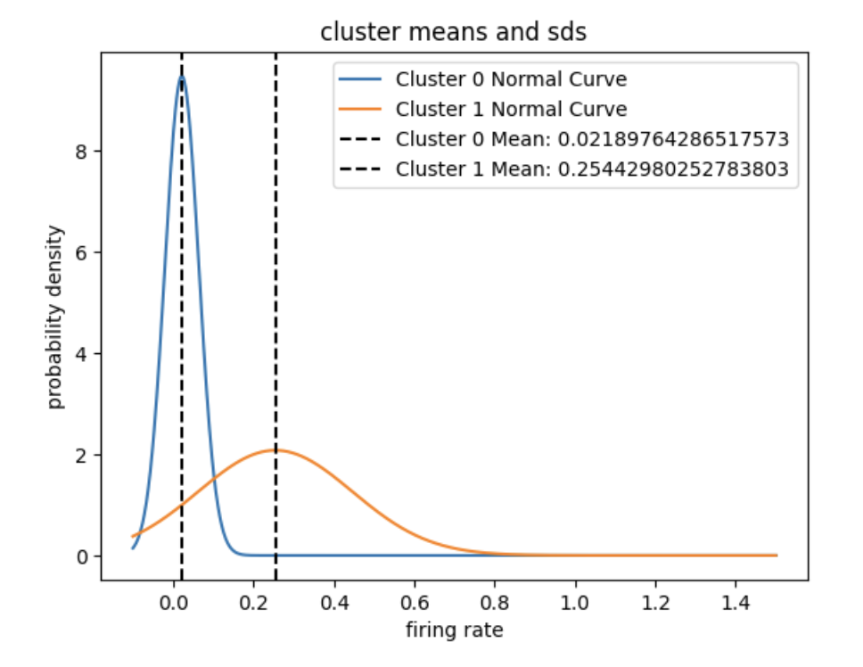
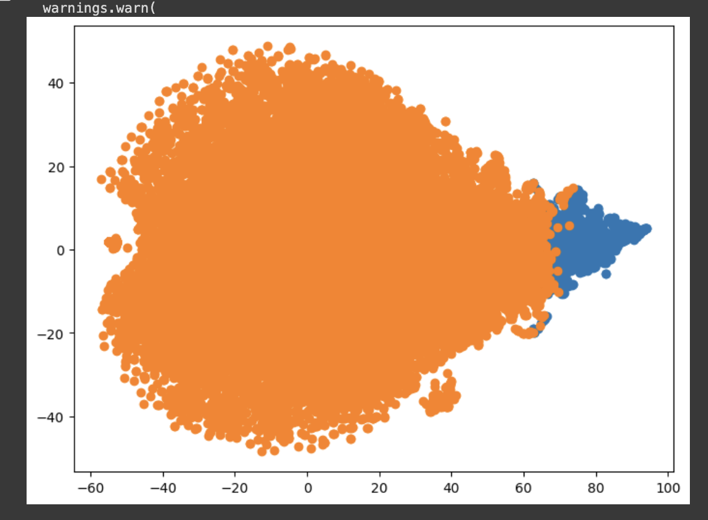
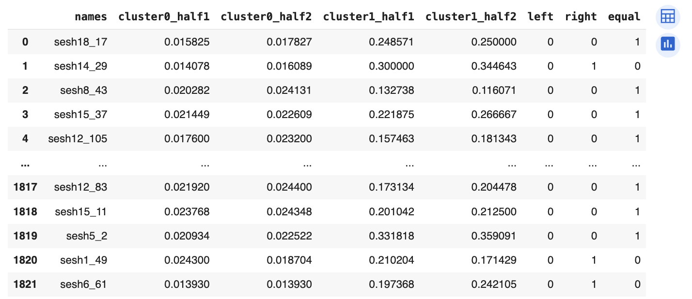
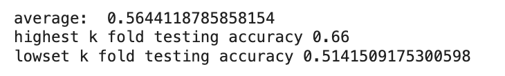
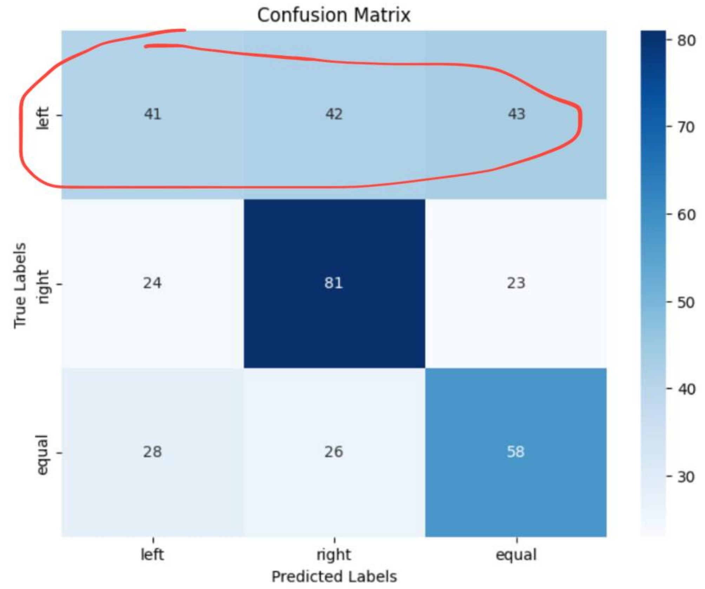
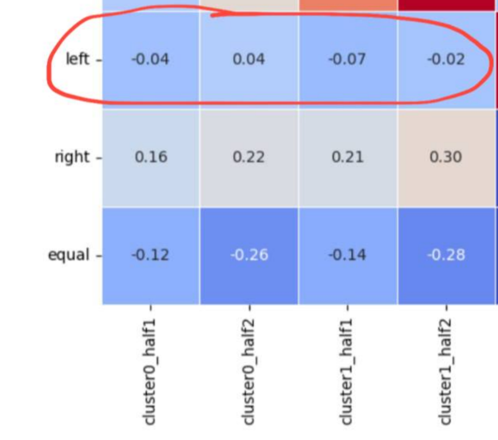

# Analysis of Mice Neural Data for Predicting Experimental Condition and Feedback Type

# Abstract 
My model attempts to predict which experimental condition the mouse was perceiving based on the neural data and then compares this prediction with the actual experimental condition to assign a feedback type. The feedback types are then compared to the actual feedback that the mouse received to determine model accuracy. The preliminary model for determining experimental condition (right contrast greater, left contrast greater, or equal contrasts) performs with upwards of 65% testing accuracy<sup>*</sup> (32% higher than random chance). Achieving significantly higher accuracy is likely impossible for this model due to very weak correlation between the data and one of the target classses, which will be discussed in more detail later. The final model for assigning feedback type based on the estimates of the preliminary model performs with 73% average testing accuracy. Possible future improvements will be discussed under 'discussion'. All code was written in Python using an object-orriented programming approach for data organization. Final models were created using Tensor Flow and PyTorch libraries 

<sup><sup>*</sup> Average testing accuracy for preliminary model for determining experimental condition in kfolds was 56% (23% higher than random chance)</sup>

# Section 1: Introduction:


The ultimate goal of this project is to use neural data recorded at the time at which a mouse is shown visual stimuli to predict if they later answered a question about the stimuli (whether or not the contrast was higher on the left or right side) correctly. Because we only have brain data for the time at which the mouse was perceiving the stimuli rather than answering or receiving feedback, my approach to this problem was to try to build a model that looks at the neuron data and tried to predict what the mouse is perceiving (whether it is seeing the left contrast as greater than the right, or right greater than the left, or equal). I plan to train my model only on instances where the mouse answered correctly to ensure that the experimental conditions are consistent with what the mouse was perceiving. Once my model is good at using the neural data to predict what the mouse saw, I will feed the test set into it and compare my model's output for what the mouse perceived to the actual trial condition. If my model output for what the mouse perceived does not match the actual trial conditions, I will predict that the mouse got it wrong. If they do match, I will predict that the mouse got it right. (Note: there are a few possible issues with the underlying assumptions of this approach that will be discussed in the 'discussion' section.) 
In the following report, I will go over my exploratory analysis and feature extraction, data integration, the training and testing of the helper model for predicting the experimental condition based on the mouse's neuron data, and the results of the final model which uses the output of the helper model to determine if the mouse answered correctly or incorrectly. 


# Section 2: Exploratory analysis:


## Graphing average neurons across trial conditions:

After organizing the data in custom classes in Python, I started my exploratory data analysis by plotting the element-wise averages of the neuron matrices for each of the different experimental conditions for each session<sup>1</sup>. I defined the conditions as "left true", "right true", "left false", "right false", and "equal true", where the first part of the name corresponds to whether the left or right contrast was higher, and the second part corresponds to whether the mouse predicted it correctly. There were 5*18 graphs in total to reflect the 5 experimental conditions and the 18 sessions. 


In these graphs, I noticed that there were not many visible differences between the trial conditions for each session. There also appeared to be some noisy neurons that were always active, such as the two bright lines in the graph above. 

<sup><sup>1</sup> _Because individual neurons measured differ between sessions, these comparisons had to be done separately for each session. Conditions were chosen based on which contrast was higher rather than the actual values of each contrast to ensure we had enough data points to perform a robust analysis_</sup>

## pairwise Welch's t-test to determine significant brain areas 

I thought these noisy neurons observed in the previous step may hint at certain brain areas that are always active and are not good predictors of visual stimuli. Because of this, I decided to do a significance test to decide which brain areas to remove. I started by doing some research about the brain areas to get a better idea of what areas were likely to be important to ensure my findings in the significance test matched domain intuition. For full descriptions, see my code.



To perform the test, I extracted all the neurons corresponding to each brain area and split them up by their trial condition. Because my project aims to determine what the mice are most likely to be perceiving, trials where the mouse answered incorrectly could skew my results since isn't clear what the mouse was perceiving it as. Thus I only used the conditions 'left true', 'right true', and 'equal true'. To account for differences in when the neurons activate, I decided to store the means of each neuron's data in the first half of the .4 seconds and the mean of each neuron's data for the second half of the .4 seconds in separate lists. Once I had lists for all brain areas and trial conditions, I performed pairwise welches t-tests<sup>2</sup> to determine the brain areas whose mean was significantly different across trial conditions at alpha = .01<sup>3</sup>. I then plotted the data and took the union of all the brain areas that were significant at alpha = .01 for at least one comparison:



<small>_in this figure LR represents the comparison between the 'left true' and 'right true' experimental conditions, ER denotes 'equal true' compared to 'right true', etc._</small>



_This graph shows the results of the significance testing for the condition 'right true' versus 'left true' for the latter .2 seconds of the neural recording. The bars represent the brain areas and their t-score associated with how much the means of the activation rate for their associated neurons differ between the two experimental conditions. The red line denotes alpha = .05 and the blue line denotes alpha = .01. I decided to use alpha = .01_

My findings allowed me to rule out 9 brain areas that were not significantly differentiating any of the trial conditions. The remaining brain areas were: CP, MOp, SUB, VISl, GPe, LP, LS, CA1, ACB, LSc, AUD, MEA, VISa, VPL, SSs, MG, VISam, DG, MS, LD, ZI, RN, PL, MB, VISpm, VISrl, ACA, TT, CA3, root, VPM, NB, TH, LGd, MOs, POST, VISp, MRN, LSr, ILA, PT, MD, PO, RT, and ORB. Many of these are consistent with my initial research on brain area function and are likely to be used in learning and visual perception. 

<sup><sup>2</sup> _welches t-tests choosen to reflect the differing sample sizes. Student t-test assumes equal variance, which is not a safe assumption when the sample sizes greatly differ as they did between 'equal' groups and 'right' or 'left' groups. This is because all of the equal groups were marked as true, whereas for 'right' and 'left' we only looked at conditions where the mouse answered correctly. Welch's test does not assume equal variances_</sup>

<sup><sup>3</sup> _alpha = .01 chosen to limit the number of features selected to reduce RAM usage and model run time_</sup>

My original plan was to use these brain areas as the features for which to bridge neurons across sessions, however, I quickly realized that each individual brain area is only present in a small subset of the data with little overlap between them; thus this goal proved impractical and I decided to try clustering. 

# Section 3: Data integration

## Clustering 

To ensure my clusters were not dominated by the trial situations, I created another custom class with the attribute left_right_equal to represent a 120 (3x40) element list containing the element-wise averages across time for all the instances of that neuron in the trial situation 'left true' (first 40 elements), followed by the element-wise averages across time for all the instances of that neuron in the trial situation 'right true' (second 40 elements), followed by the element-wise averages across time for all the instances of that neuron in the trial situation 'equal true' (first last 40 elements)
Originally I tried to find three clusters, however, one of the clusters was very small, so I limited my analysis to only 2. Although the TSNE visual plot does not show much differentiation between clusters, plotting the cluster means and standard deviations as normal curves show noticeable differences<sup>4</sup>

  

_Note: the weird appearance of the clusters on the right may be the result of compressing a 120-dimensional space into 2 dimensions in tsne._

<sup><sup>4</sup> _Normal curves were used since we performed the clustering on means, and the CLT tells us that for large sample sizes, the expected value of the mean follows an approximately normal distribution centered at the E(Xbar), which is the cluster mean_</sup>

## Creating Data Frame

Now that I had a way of grouping neurons across sessions, I was able to create a data frame in pandas.


 

_cluster0_half1	represents the mean firing rate for the neurons from that trial in cluster 0 for the first half of the .4 second time interval. cluster0_half2, cluster1_half1, and cluster1_half2 have analogous meanings. Rows represent trials. Note: I only included trials where the mouse answered correctly due to my goal of trying to understand the relationship between the neurons and what the mouse is perceiving. 'Right' will equal 1 when right contrast  > left contrast, 'Left' will equal 1 when left contrast  > right contrast, otherwise, 'Equal' will be 1_ 


Then I plotted the correlation matrix to ensure that my predictors were describing the target values well, and to my dismay **I found almost no correlation between my predictors and the column 'left'**:


I tried to revisit my brain area selection as well as trying without clusters and with different clusters, but no matter how I processed the data, I was never able to improve the correlation between my predictors and 'left'

# Section 4: Predictive modeling

As stated earlier, my approach for this project is to try to predict what the mouse perceived based on the neuron data, and then compare what they perceived with what the contrast values were to predict feedback type. Thus I trained my model on only the trials where the mouse answered correctly to ensure that the neuron values correspond to the values we should expect when the mouse is perceiving those contrasts. 

I decided to use a feedforward neural net with the following parameters which I found after parameter tuning to predict the probabilities of the one-hot-encoded output:

```
model = Sequential([
        Dense(64, activation='relu', input_shape=(X_train.shape[1],)),
        Dense(256, activation='relu'),
        Dense(256, activation='relu'),
        Dense(256, activation='relu'),
        Dense(256, activation='relu'),
        Dense(3, activation='softmax') # three output neurons to account for the 3 categories we are trying to predict
    ])
    model.compile(optimizer='adam', loss='categorical_crossentropy', metrics=['accuracy'])
```
However, after running the model, I noticed that it was always predicting 'equal' more than any other class. 


_Regardless of the true trial condition, my model is most likely to predict 'equal'_

I investigated the data and realized this was likely because the 'equal' class was greatly overrepresented in my data frame. This is because I was only selecting the conditions for which the mouse answered correctly, and based on the experimental design, any answer for equal was marked as correct. Thus there were more 'equal' values than 'left' or 'right'

```
Number of rows where 'right' equals 1: 1217
Number of rows where 'left' equals 1: 1331
Number of rows where 'equal' equals 1: 1686
```

To remedy this, I made the difficult decision to remove some of the 'equal' rows to make it even with the other 2 classes. I also scaled the data using min_max scaling with the hopes that may help performance <sup>5</sup>. To deal with the loss of data from removing rows, I used kFolds validation to train my data to ensure that I was still using all the data in my training across all the folds. 

<sup><sup>5</sup> Standardization was done on the whole dataset rather than the training, testing, and validation sets separately due to the challenges of standardizing separately for every iteration within the k folds loop</sup> 

Within the folds, I used 5% of the data for validation and 5% for testing. I used the validation data when training to implement early stopping to prevent overfitting (model stops early when validation accuracy stops improving alongside training accuracy) and model checkpoints (only updates the weights when the validation accuracy improves)
Note: validation data and test data are separate. No testing data was seen during training.

At the end of each fold, I evaluated the model on the test data for that fold and printed a confusion matrix like the following example:


The average testing accuracy across the kFolds was 56% (**note that they are selecting among 3 possibilities, so random chance would result in expected accuracy of 33%, thus the model performs 23% better than random chance**) 
The highest kFold testing accuracy was 65%, or **32% better than random chance**. 



One thing I noticed was that most of the matrices show that the model determines 'equal' and 'right' with higher accuracy than 'left'. I think this corresponds with the extremely low correlations between our predictor variables and instances of 'left' that we observed in the correlation matrix. Here is an example from one of the lower preforming folds:

  

_In this figure, the model struggles to predict the class 'left' accurately. This likely corresponds to low correlation between 'left' class and the predictor variables_

**Note: It seems highly unlikely that one could achieve a significantly more accurate model for predicting experimental conditions with this data due to the very low correlation between some of the target classes and their predictor variables. I am confident in all the steps I took in my preprocessing and data integration and have even tried different methods such as forgoing clustering and not excluding brain areas, and all resulted in similarly low correlations and mediocre model performance. Other more ambitious undertakings such as trying to integrate the data based on the brain areas most significant for each class proved futile due to how the brain areas were dispersed unevenly across sessions. 
Perhaps I could have predicted eventual feedback better if I had worked directly with the feedback data rather than trying to predict what the mouse saw based on neuron activity. This will be discussed more in the 'discussion' section.**

# Section 5: Prediction performance on the test sets

Once the test data was posted, I reran my entire project with the test data included to ensure it was properly preprocessed and clustered. Then I used each of my final models from k-folds to predict the test data. I compared my predicted class memberships (ie the predicted trial conditions based on the neural data) with the true class memberships (the real trial conditions) and for each correct row in which the two corresponded, I predicted a feedback type of 1, and for each row that they did not correspond, I predicted a feedback of 0 (indicated as -1 in the original data). Then I took the sum of the true feedback list (which contains 1s and 0s) and my predictions to find the percentage that I was predicting correctly. **The average accuracy across models was 73% with a very small standard deviation of 0.009**

```
accuracy for this model (each model trained on different training and valiadation fold)  0.7379310344827587
accuracy for this model (each model trained on different training and valiadation fold)  0.7379310344827587
accuracy for this model (each model trained on different training and valiadation fold)  0.7379310344827587
accuracy for this model (each model trained on different training and valiadation fold)  0.7379310344827587
accuracy for this model (each model trained on different training and valiadation fold)  0.7172413793103448
average final accuracy:  0.7337931034482759 sd:  0.009252695079309493 max:  0.7379310344827587
```


# Section 6: Discussion

While I am happy with my model's performance, there are 2 main things that I believe hindered me in this project. The first was my inability to accurately classify trials where the left contrast was higher than the right due to extremely low correlation between the 'left' class and the predictors. This problem, I feel, was likely unavoidable due to the nature of the data itself. I feel it is unlikely one could make a model with significantly higher accuracy for predicting trial condition using the same data due to that limitation. 

The second thing I could have done different is to incorporate the feedback types into my training in order to see if there was any correlation between the neural data and whether the mouse anwsered correctly or incorrectly. I may address this second question in a future project

